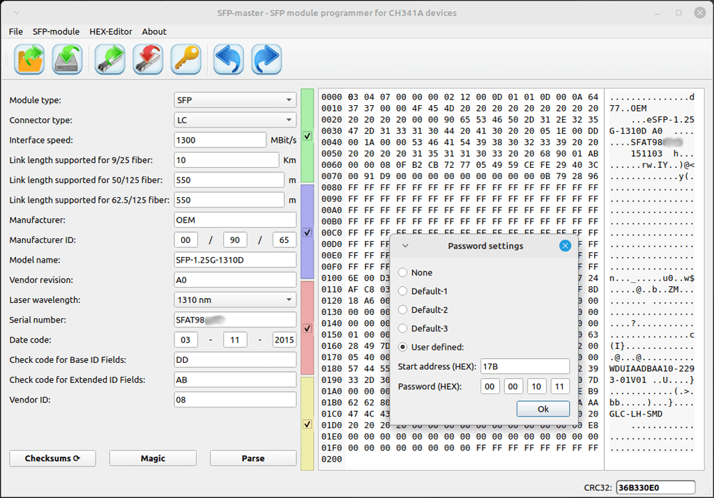
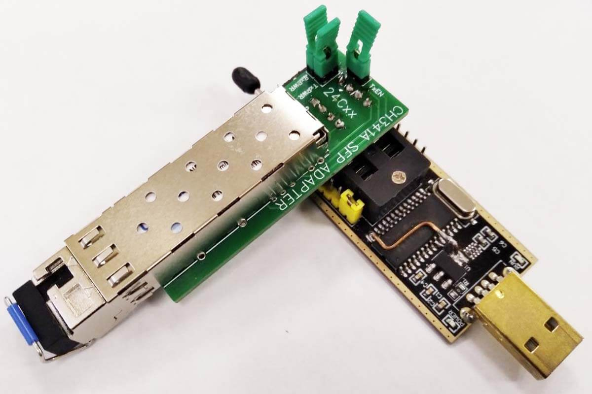

# SFP-Master

* [Installing in Linux](#installing-in-Linux)
* [Connection](#connection)
* [How to use](#how-to-use)
* [Packages](#packages)
* [Changelog](ChangeLog)
* [Licensing](#Licensing)
* [Translations](#Translations)

SFP-module data programmer for CH341a devices

 

**SFP-Master** is a free software programmer of optical `SFP modules` for CH341a
devices. It can be used to read, write and save SFP module data to the computer. 
The SFP-Master makes respect to [QHexEdit2](https://github.com/Simsys/qhexedit2) 
hex editor and [ch341prog](https://github.com/setarcos/ch341prog).
SFP-Master requires an SFP to I2C adapter. This adapter is used to read and 
program SFP-module data. It must be inserted into the slot labelled `24xxx` of 
the CH341a programmer.


- See more details [here](https://github.com/bigbigmdm/Tools_for_CH341A_programmer?tab=readme-ov-file#Homemade-Chip-adapters).

The OSHWLAB project of this adapter is [here](https://oshwlab.com/einkreader/ch341a_sfp_adapter).

Jumpers J1 to J3 (TxPWR, RxPWR, TxEN) must be installed initially. They are used
to supply power to the SFP module. If you want to program a module with 
hardware write protection, remove one of the jumpers and try to program 
the module. 
If it fails, remove the other jumper and repeat the operation.

# Installing in Linux

For build are needed:
- g++ or clang
- CMake
- libusb 1.0
- Qt5
- Qt5 Qt5LinguistTools
- pkgconf or pkg-config
- udev

On Debian and derivatives:

`sudo apt-get install cmake g++ libusb-1.0-0-dev qtbase5-dev qttools5-dev pkgconf`

On Debian >=13 and Ubuntu >=23.10:

`sudo apt-get install systemd-dev`

On older:

`sudo apt-get install udev`

To build and install the SFP-Master enter:

`sudo ./build_all.sh`

To uninstall, enter:

`sudo ./uninstall.sh`

### [Install](https://hu.blackpanther.hu/alkalmazas-letoltes/sfp-modul-olvaso-iro-mester-flasher/) to blackPanther OS

`installing sfp-master`

# Connection

To work with the programmer, connect the SFP module to the connector in the SFP
 adapter, connect the SFP adapter to the CH341A programmer device to the slot 
 marked `24xx`. Connect the CH341A Programmer Unit to the USB connector of the
 computer and start the `SFP-Master` program.



# How to use
The hexadecimal chip editor (right side of the screen) is used to display and 
modify buffer data.

It contains the following controls: `Hex-Editor / Undo` or 
 or `<Ctrl+Z>` undo and 
`Hex-Editor / Redo` or  or `<Ctrl+Y>` redo.

- Pressing `SFP-module / Read from SFP` or  or `<Ctrl+R>`
 to read data from the SFP-module into the computer buffer.
- Pressing `SFP-module / Write to SFP` or  or `<Ctrl+W>`
 to write data from the 
computer buffer into the SFP-module.
- Press `SFP Module / Set Module Password` or  or
 `<Ctrl+P>` to bring up
the password setting menu for modules that are password protected.
- The checkboxes are used to select the address area for read, write or save
 procedures:
 
|  Checkbox colour  | SFP-Master address | Real SFP address |
| :---              |       :---:        |       :---:      |
| Green (Always on) |   0x0000 - 0x007F  |  0xA000 - 0xA07F |
| Blue              |   0x0080 - 0x00FF  |  0xA080 - 0xA0FF |
| Red               |   0x0100 - 0x017F  |  0xA200 - 0xA27F |
| Yellow            |   0x0180 - 0x01FF  |  0xA280 - 0xA2FF |

The `Parse` button is used to re-parse hexadecimal data in the hex editor, if 
they have been changed manually.

The `Checksum` button is used to calculate two checksums (addresses 0x03F and 
0x05F according to SFF-8472 Rev 12.3), 
if the module data have been changed manually in the hex editor.

Changing the data on the left side of the screen automatically causes the data 
to be changed in the hex editor.

- The `File / Save` or  or `<Ctrl+S>` button is used to 
save the computer buffer to a file.
- The `File / Open`  or  or `<Ctrl+O>` button is used to 
save the file in the computer buffer.
- The `File / Exit`  or  or `<Ctrl+X>` button is used to 
close the program. 

## Packages

- For some versions of Fedora, you can use the COPR repositories.
```
sudo dnf install dnf-plugins-core
sudo dnf copr enable bigmdm/sfp-master
sudo dnf install sfp-master
``` 
- For some versions of UBUNTU, you can use the Launchpad repositories.
```
sudo add-apt-repository ppa:bigmdm/sfp-master
sudo apt update
sudo apt install sfp-master
``` 

<a href="https://repology.org/project/sfp-master/versions">
    
</a>

- The `ARCH AUR repository` by [Giovanni Scafora](https://github.com/giovanni69) is [here](https://aur.archlinux.org/packages/sfp-master-git)

- The Windows release by [Anime4000](https://github.com/Anime4000) is [here](https://github.com/Anime4000/SFP-Master/releases)

## Licensing

Copyright (C) 2024 - 2025 Mikhail Medvedev. 
This project and [ch341prog](https://github.com/setarcos/ch341prog) use 
[GPL-3+ License](https://www.gnu.org/licenses/gpl-3.0.html), 
some parts taken from project [QHexEdit2](https://github.com/Simsys/qhexedit2) 
is [LGPL-2.1](https://www.gnu.org/licenses/old-licenses/lgpl-2.1.html). 

## Translations

- Italian translation by [Giovanni Scafora](https://github.com/giovanni69)

- Hungarian translation by [Charles K Barcza](https://github.com/blackPantherOS)

- Brasil translation by [Alexandre C. Leite](https://github.com/alexandrecleite)

- German translation by [Wucke13](https://github.com/wucke13)

Anyone can add or improve a translation by making a pull request.
Translations files are located in:
[language/](https://github.com/bigbigmdm/SFP-Master/tree/main/language) 

You can also add translation to the desktop file ([SFP-Master.desktop](https://github.com/bigbigmdm/SFP-Master/blob/main/other/SFP-Master.desktop)).

